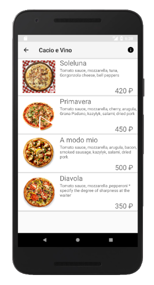

# Menu Management System
System for restaurants for showing the menus for the customers.\
Used language: Java\
Authors: Vladislav Kuleykin (App), Faeel Zaripov (Server)

## Purpose
This application was created for the Software Architecture course.

## How to run
To run this system, you'll need to set up a server. It's located in the `server` branch.
The server was implemented in Python, using the `Flask` library, so be sure to install that first.
To setup it, simply run the `app.py` file, and the local address for the server will be shown in the CLI\
After that, in the app code go to the `/app/.../menumanagementsystem/serverApi/Constants.java` and change the `BASE_URL` to your server address.

## Screenshots

  
  

